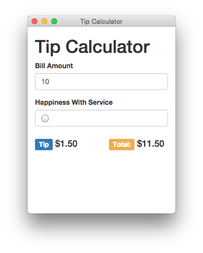

# Electron Tip Calculator

A simple example using Electron with Bootstrap and jQuery




## Requirements

* Bower
* Electron
* jQuery

## Setup

```
$ npm install
$ bower install
```

## Run

```
$ ./node_modules/.bin/electron .
```

## Package

Create packages for multiple operating systems

~~~
$ ./node_modules/.bin/electron-packager ./ TipCalculator --platform=darwin --arch=all --version=0.34.1 --out=dist
~~~

## License

MIT


